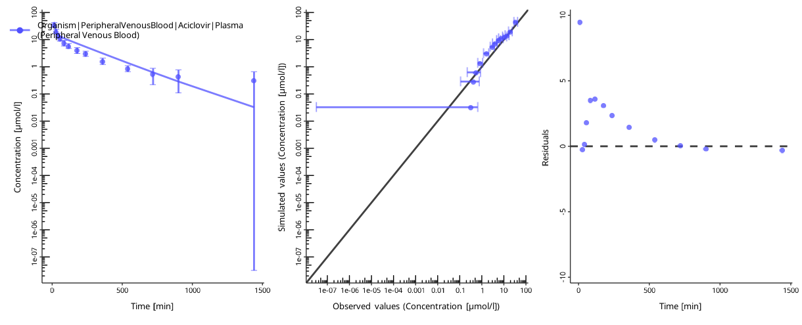
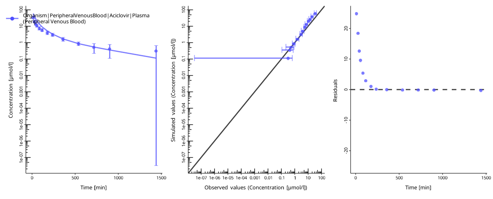
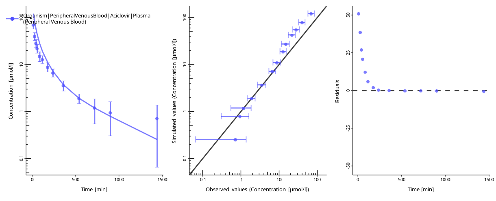

# User guide

### Parameter estimation problems

Biosimulation models include numerical parameters that determine the
outputs of the model. Often, the values of these parameters are not
known in advance and have to be identified by matching possible model
outputs to the observed data. Finding parameter values that best match
the observed data is called *parameter identification*.

The
[ospsuite.parameteridentification](https://github.com/Open-Systems-Pharmacology/OSPSuite.ParameterIdentification)
package provides a workflow for setting up such tasks based on existing
PKML models, mapping model outputs to observed data, and estimating
parameters. Below, three models of increasing complexity are used to
demonstrate the functionality of the package.

### PI workflow

The overall workflow is similar to running parameter identification (PI)
in PK-Sim or MoBi, see the corresponding [documentation
chapter](https://docs.open-systems-pharmacology.org/shared-tools-and-example-workflows/parameter-identification).

To set up a PI task, the user has to define:

- A set of simulations

  - You can use multiple simulations in one optimization task. As an
    example, you can identify a value of the same parameter (e.g., the
    lipophilicity of the compound) using data for different dosings.

- Definition of parameters to be identified

- Mapping of model outputs to observed data

- Configuration of the optimization task, including selection of
  algorithm and algorithm options.

#### Simulations

A set of `Simulation` objects. See the documentation of `{ospsuite-r}`
on [how to load and adjust
simulations](https://www.open-systems-pharmacology.org/OSPSuite-R/articles/load-get.html).

For this example, we will load two instances of the Aciclovir PBPK model
provided with the `{ospsuite-r}` package. We want to optimize the
lipophilicity and the renal clearance using plasma concentration data
gathered after a 10-minute intravenous infusion of aciclovir at doses
250 mg and 500 mg. Lipophilicity will be considered a
scenario-independent parameter, i.e., the same value will be applied for
both simulations. For the renal clearance, we can assume an
inter-individual variability and will optimize the value of this
parameter separately for each dose group.

We will start by loading the simulation of the \*.pkml file twice. The
dose in this simulation is set to 250 mg. Remember that both
`Simulation` objects are created by loading the same \*.pkml file, they
represent two independent instances of a simulation.

``` r
library(ospsuite.parameteridentification)

sim_250mg <- loadSimulation(system.file("extdata", "Aciclovir.pkml", package = "ospsuite"))
sim_500mg <- loadSimulation(system.file("extdata", "Aciclovir.pkml", package = "ospsuite"))
```

In the next step, we will retrieve the objects of the application dose
parameters and change the dose of the second simulation to 500 mg.

``` r
# Path to the dose parameter
doseParameterPath <- "Applications|IV 250mg 10min|Application_1|ProtocolSchemaItem|Dose"
# Get the parameter from the first simulation

# Get the instances of the parameters
sim_250mg_doseParam <- getParameter(path = doseParameterPath, container = sim_250mg)
print(sim_250mg_doseParam)
#> <Parameter>
#>   • Quantity Type: Parameter
#>   • Path: Applications|IV 250mg 10min|Application_1|ProtocolSchemaItem|Dose
#>   • Value: 2.50e-04 [kg]
#> 
#> ── Formula ──
#> 
#>   • isConstant: TRUE
sim_500mg_doseParam <- getParameter(path = doseParameterPath, container = sim_500mg)

# Chage the value to 500 mg
setParameterValues(parameters = sim_500mg_doseParam, values = 500, units = "mg")
print(sim_500mg_doseParam)
#> <Parameter>
#>   • Quantity Type: Parameter
#>   • Path: Applications|IV 250mg 10min|Application_1|ProtocolSchemaItem|Dose
#>   • Value: 5.00e-04 [kg]
#> 
#> ── Formula ──
#> 
#>   • isConstant: TRUE
```

#### Definition of parameters to be identified

Specification of parameters to be identified is done by creating objects
of the class `PIParameters`. A `PIParameter` describes a single model
parameter or a group of parameters that will be optimized together,
i.e., all model parameters grouped to a `PIParameters` object will have
the same value during the optimization. A `PIParameter` also defines the
optimization’s start and the minimal and maximal values.

If multiple model parameters are linked in one `PIParameters` instance,
they can belong to different simulations or come from the same
simulation. If you have, for example, two simulations for two
individuals with the same compound, you may have one identification
parameter, lipophilicity, which is linked to both lipophilicity
parameters in the two simulations. At the same time, you can define two
identification parameters for the individual reference concentrations of
a specific enzyme.

Consider the example above. We will create three `PIParameters`
objects - one for the lipophilicity of aciclovir, where the parameters
from the two simulations are linked together, and two `PIParameters` for
the renal clearance, as they are considered independent.

``` r
# Creating a PIParameters object with two simulation parameters retrieved from different simulations
piParameterLipo <- PIParameters$new(parameters = list(
  getParameter(path = "Aciclovir|Lipophilicity", container = sim_250mg),
  getParameter(path = "Aciclovir|Lipophilicity", container = sim_500mg)
))

# Creating two separate PIParameters for the renal clearance
piParameterCl_250mg <- PIParameters$new(parameters = getParameter(path = "Neighborhoods|Kidney_pls_Kidney_ur|Aciclovir|Renal Clearances-TS|TSspec", container = sim_250mg))
piParameterCl_500mg <- PIParameters$new(parameters = getParameter(path = "Neighborhoods|Kidney_pls_Kidney_ur|Aciclovir|Renal Clearances-TS|TSspec", container = sim_500mg))
```

Each `PIParameter` has the following properties:

- `$value`: Current value of the parameter. Corresponds to the value of
  the `Parameter` object used in the `PIParameters`. If multiple
  parameters are linked together, the value of the first parameter added
  is used.

- `$startValue`: Start value of the parameter(s) used in the
  identification. By default, the value of the first added parameter.
  Can be changed.

- `$minValue`: Minimal allowed value. By default, 0.1-fold of the start
  value. Can be changed.

- `$maxValue`: Maximal allowed value. By default, 10-fold of the start
  value. Can be changed.

- `$unit`: Unit of the start, min, and max values. WARNING: changing the
  unit does not update the values! E.g., the default start, min, and max
  values of the renal clearance parameter are given in `1/min`:

``` r
print(piParameterCl_250mg)
#> <PIParameters>
#>   • Number of parameters: 1
#>   • Value: 0.9412
#>   • Start value: 0.9412
#>   • Min value: 0.09412
#>   • Max value: 9.412
#>   • Unit: 1/min
```

Setting the unit to `1/h` will cause the identification to start at
`0.94 1/h`, while the current value is still `0.94 1/h` or
`0.94 1/h * 60 min = 56.47 1/h`:

``` r
piParameterCl_250mg$unit <- ospUnits$`Inversed time`$`1/h`
print(piParameterCl_250mg)
#> <PIParameters>
#>   • Number of parameters: 1
#>   • Value: 56.47
#>   • Start value: 0.9412
#>   • Min value: 0.09412
#>   • Max value: 9.412
#>   • Unit: 1/h
```

We will set the boundaries for lipophilicity to \[-10, 10\], and for
renal clearance to \[0, 10\] `1/min`:

``` r
piParameterLipo$minValue <- -10
piParameterLipo$maxValue <- 10

piParameterCl_250mg$minValue <- 0
piParameterCl_250mg$maxValue <- 10
piParameterCl_250mg$unit <- ospUnits$`Inversed time`$`1/min`

piParameterCl_500mg$minValue <- 0
piParameterCl_500mg$maxValue <- 10
piParameterCl_500mg$unit <- ospUnits$`Inversed time`$`1/min`

print(piParameterLipo)
#> <PIParameters>
#>   • Number of parameters: 2
#>   • Value: -0.097
#>   • Start value: -0.097
#>   • Min value: -10
#>   • Max value: 10
#>   • Unit: Log Units
print(piParameterCl_250mg)
#> <PIParameters>
#>   • Number of parameters: 1
#>   • Value: 0.9412
#>   • Start value: 0.9412
#>   • Min value: 0
#>   • Max value: 10
#>   • Unit: 1/min
print(piParameterCl_500mg)
#> <PIParameters>
#>   • Number of parameters: 1
#>   • Value: 0.9412
#>   • Start value: 0.9412
#>   • Min value: 0
#>   • Max value: 10
#>   • Unit: 1/min
```

#### Mapping of model output to observed data

In order to calculate the error of the model, simulation outputs must be
linked to observed data. One simulation output can be linked to multiple
observed data sets in this framework. The error will be calculated for
each pair of simulated output and linked data set and added up for the
total error. The mapping is done by creating an object of the class
`PIOutputMapping`. Each object links a single
[`Quantity`](https://www.open-systems-pharmacology.org/OSPSuite-R/reference/Quantity.html)
of a simulation to multiple
[`DataSet`](https://www.open-systems-pharmacology.org/OSPSuite-R/reference/DataSet.html)
objects.

In the first step, we will load two observed data sets from the Excel
file provided with the package. Read the article [Observed
data](https://www.open-systems-pharmacology.org/OSPSuite-R/articles/observed-data.html)
from the
[ospsuite](https://github.com/open-systems-pharmacology/ospsuite-r)
documentation for details.

``` r
filePath <- system.file("extdata", "Aciclovir_Profiles.xlsx", package = "ospsuite.parameteridentification")

# Create importer configuration for the file
importConfig <- createImporterConfigurationForFile(filePath = filePath)
# Set naming patter
importConfig$namingPattern <- "{Source}.{Sheet}.{Dose}"
# Import data sets
obsData <- loadDataSetsFromExcel(xlsFilePath = filePath, importerConfigurationOrPath = importConfig, importAllSheets = TRUE)

print(names(obsData))
#> [1] "Aciclovir_Profiles.Vergin 1995.Iv.250 mg"
#> [2] "Aciclovir_Profiles.Vergin 1995.Iv.500 mg"
```

The data sets hold concentration data of aciclovir in venous blood; the
corresponding simulation output has the path:

``` r
simOutputPath <- "Organism|PeripheralVenousBlood|Aciclovir|Plasma (Peripheral Venous Blood)"
```

We will create two objects of the `PIOutputMapping` class, one for each
dose group:

``` r
outputMapping_250mg <- PIOutputMapping$new(quantity = getQuantity(path = simOutputPath, container = sim_250mg))

outputMapping_500mg <- PIOutputMapping$new(quantity = getQuantity(path = simOutputPath, container = sim_500mg))
```

and link simulation results to the corresponding observed data:

``` r
outputMapping_250mg$addObservedDataSets(obsData$`Aciclovir_Profiles.Vergin 1995.Iv.250 mg`)
outputMapping_500mg$addObservedDataSets(obsData$`Aciclovir_Profiles.Vergin 1995.Iv.500 mg`)

print(outputMapping_250mg)
#> <PIOutputMapping>
#>   • Output path: Organism|PeripheralVenousBlood|Aciclovir|Plasma (Peripheral
#>   Venous Blood)
#>   • Observed data labels: Aciclovir_Profiles.Vergin 1995.Iv.250 mg
#>   • Data weight labels: NULL
#>   • Scaling: lin
```

The scaling of the output mapping defines how the residuals between
simulated and observed data are calculated. For details, see the article
error-functions. For concentration data, we will change the scaling to
logarithmic:

``` r
outputMapping_250mg$scaling <- "log"
outputMapping_500mg$scaling <- "log"
```

All data sets (simulated results and observed data) within a
`PIOutputMapping` can be transformed by applying offsets and scaling
factors following the same logic implemented in the [`DataCombined`
class](https://www.open-systems-pharmacology.org/OSPSuite-R/articles/data-combined.html#transformations).

#### Configuration

The configuration of a PI includes the selection of an algorithm,
setting algorithm settings, and some further options. A PI configuration
is defined in a `PIConfiguration` object and can be re-used by multiple
PI tasks. If no user-defined configuration is provided to a PI task, a
default one is created with the following properties:

``` r
piConfiguration <- PIConfiguration$new()
print(piConfiguration)
#> <PIConfiguration>
#>   • Optimization algorithm: BOBYQA
#>   • Confidence interval method: hessian
#>   • Objective function type: lsq
#>   • Residual weighting method: none
#>   • Robust residual calculation method: none
#>   • Print feedback after each function evaluation: FALSE
```

- `printEvaluationFeedback` (logical) indicates if the objective
  function value should be printed at each iteration

- `simulationRunOptions`: Object of type
  [`SimulationRunOptions`](https://www.open-systems-pharmacology.org/OSPSuite-R/reference/SimulationRunOptions.html)
  that will be passed to simulation runs. If `NULL`, default options are
  used.

- `targetFunctionType` (possible values are listed in
  [`ospsuite.parameteridentification::ObjectiveFunctionOptions`](https://www.open-systems-pharmacology.org/OSPSuite.ParameterIdentification/dev/reference/ObjectiveFunctionOptions.md))
  indicates which objective function should be used to calculate the
  difference between observed data and simulated curve. See the article
  [`vignette("error-calculation")`](https://www.open-systems-pharmacology.org/OSPSuite.ParameterIdentification/dev/articles/error-calculation.md)
  for more information.

- `algorithm` (possible values: HJKB, BOBYQA, DEoptim) indicates which
  of the optimization algorithms should be used. Algorithm options can
  be specified as a list and passed to
  `piConfiguration$algorithmOptions`. Supported algorithms and their
  options are described in
  [`vignette("optimization-algorithms")`](https://www.open-systems-pharmacology.org/OSPSuite.ParameterIdentification/dev/articles/optimization-algorithms.md).

The default settings are listed in `AlgorithmOptions_XYZ`, where `XYZ`
is the algorithm’s name. For example, the default settings for the
`BOBYQA` algorithm are stored in `AlgorithmOptions_BOBYQA`:

``` r
print(AlgorithmOptions_BOBYQA)
#> $stopval
#> [1] -Inf
#> 
#> $xtol_rel
#> [1] 1e-06
#> 
#> $maxeval
#> [1] 1000
#> 
#> $ftol_rel
#> [1] 0
#> 
#> $ftol_abs
#> [1] 0
#> 
#> $check_derivatives
#> [1] FALSE
```

E.g. to set the maximal number of function evaluations to 1500 for the
`BOBYQA` algorithm, we can use the following code:

``` r
algOptions <- AlgorithmOptions_BOBYQA
algOptions$maxFunctionEvaluations <- 1500
piConfiguration$algorithmOptions <- algOptions
```

#### Running a parameter identification task

After the simulation, identification parameters, mappings of observed
and simulated data, and the configuration are defined, they are used in
an instance of the `ParameterIdentification` class:

``` r
piTask <- ParameterIdentification$new(
  simulations = list(sim_250mg, sim_500mg),
  parameters = list(piParameterLipo, piParameterCl_250mg, piParameterCl_500mg),
  outputMappings = list(outputMapping_250mg, outputMapping_500mg),
  configuration = piConfiguration
)
```

We first can create time profiles comparing simulation results with
observed data with the current parameter values. A separate time profile
is created for each `PIOutputMapping`.

``` r
piTask$plotResults()
#> [[1]]
```



    #> 
    #> [[2]]


NOTE: the figures are created with the current values of the parameters,
not the start values!

We can now run the PI and print the results:

``` r
piResult <- piTask$run()
print(piResult)
#> <PIResult>
#> Optimization Summary:
#>   • Algorithm: BOBYQA
#>   • CI Method: hessian
#>   • Convergence: TRUE
#>   • Objective value: 6.536
#>   • Iterations: 109
#>   • Function evaluations: 109
#>   • Elapsed (optimization): 26.54 s
#>   • Elapsed (CI): 11.89 s
#> Parameter Estimates:
#>   • Lipophilicity: Estimate = -1.282, SD = 0.1090, CV = 0.08505, CI = [-1.495,
#>   -1.068]
#>   • TSspec: Estimate = 0.8353, SD = 0.1651, CV = 0.1977, CI = [0.5116, 1.159]
#>   • TSspec: Estimate = 0.7572, SD = 0.1513, CV = 0.1999, CI = [0.4605, 1.054]
```

`piResult` is an R6 object that encapsulates the optimization output
(and, if configured, confidence intervals) and provides helper methods
like `$toDataFrame()` and `$toList()` for exporting results.

#### Export the results

- Use `$toDataFrame()` to get a tidy table of parameter estimates and
  related fields:

``` r
piResult$toDataFrame()
#>   group          name
#> 1     1 Lipophilicity
#> 2     2        TSspec
#> 3     3        TSspec
#>                                                                                     path
#> 1                                                 Vergin 1995 IV|Aciclovir|Lipophilicity
#> 2 Vergin 1995 IV|Neighborhoods|Kidney_pls_Kidney_ur|Aciclovir|Renal Clearances-TS|TSspec
#> 3 Vergin 1995 IV|Neighborhoods|Kidney_pls_Kidney_ur|Aciclovir|Renal Clearances-TS|TSspec
#>        unit   estimate        sd         cv    lowerCI   upperCI ciType
#> 1 Log Units -1.2816387 0.1090013 0.08504839 -1.4952774 -1.068000   <NA>
#> 2     1/min  0.8352532 0.1651480 0.19772213  0.5115690  1.158937   <NA>
#> 3     1/min  0.7571563 0.1513412 0.19988100  0.4605331  1.053780   <NA>
#>   initialValue
#> 1    -0.097000
#> 2     0.941241
#> 3     0.941241
```

- Use `$toList()` to export full details, including diagnostics, cost
  metrics, and residuals.  
  `costDetails` includes items such as `SSR`, `residuals`,
  `errorWeights`, `userWeights`, `yObserved`, and `ySimulated`:

``` r
names(piResult$toList())
#>  [1] "finalParameters"   "objectiveValue"    "initialParameters"
#>  [4] "convergence"       "algorithm"         "elapsed"          
#>  [7] "iterations"        "fnEvaluations"     "ciMethod"         
#> [10] "ciElapsed"         "ciError"           "ciDetails"        
#> [13] "sd"                "cv"                "lowerCI"          
#> [16] "upperCI"           "ciType"            "paramNames"       
#> [19] "costDetails"
```

#### Diagnostics

To assess the goodness of the fit, plot the time profiles after the
optimization:

``` r
piTask$plotResults()
#> [[1]]
```



    #> 
    #> [[2]]



The quality of the fit can be assessed by the following criteria:

- The individual time profile is close to the observed data points.
- The predicted-vs-observed plot is close to the diagonal.
- The residuals are randomly distributed above and below zero.

The residuals only above or only below zero indicate an overprediction
or an underprediction. Another set of parameters will likely result in a
better fit.
